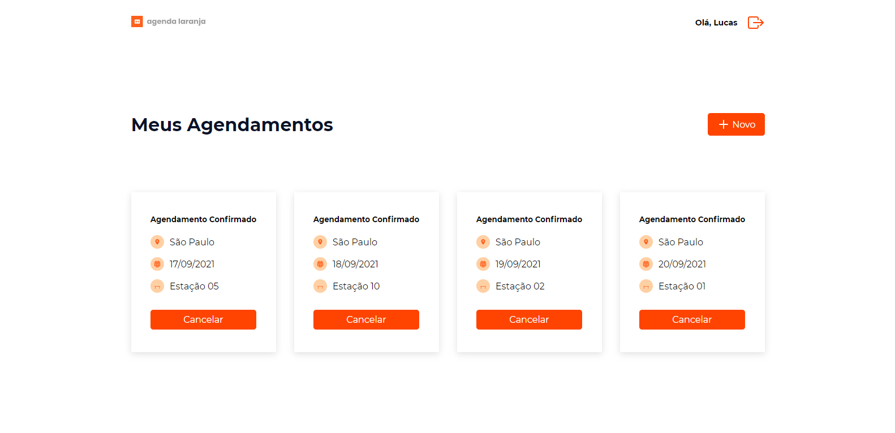

<br><br>

<p align="center" >
  <a href="#-sobre-o-projeto" >Sobre</a> •
  <a href="#-funcionalidades">Funcionalidades</a> •
  <a href="#-tecnologias-utilizadas">Tecnologias</a> •
  <a href="#-como-executar-o-projeto">Como executar o projeto</a>
</p>

<br>
<br>

# 🖥️ Sobre o projeto

<p>📅 Agenda Laranja - é um meio prático e eficiente para programar o dia do trabalho presencial, respeitando as normas de segurança.</p>

Esse é o Front-end do projeto, para poder utilizar a API/Back-end [acesse aqui!](https://github.com/lucasgoncalvesbt/agendalaranja-api)

<p>Projeto desenvolvido durante o Hackaton do Programa de Formação do Grupo FCamara 2021 Season 2.</p>
<br>

# 📸 Screenshots

<br>


<br>
<br>

# ⚙ Funcionalidades
- Usuarios se cadastram na aplicação e podem:
  - Realizar um agendamento.
  - Cancelar um agendamento.

<br>
<br>

# 💡 Tecnologias Utilizadas
O projeto foi desenvolvido utilizando as seguintes tecnologias:
- [ReactJs](https://pt-br.reactjs.org/)
- [Sass](https://sass-lang.com/)

<br>
<br>

# 🚀 Como executar o projeto
## Pré-requisitos
  - [Git](https://git-scm.com/downloads) ( Para clonar o repositório )
  - [Node.js](https://nodejs.org/en/) e [Yarn](https://yarnpkg.com/getting-started/install) ( Para rodar os scripts de execução do projeto e instalação dos pacotes)
  - [VSCode](https://code.visualstudio.com/) ( Opcional - editor de código para você trabalhar com o código )

<br>

## Agora execute os seguintes comandos:

```bash
#Clone este repositorio
$ git clone https://github.com/lucasgoncalvesbt/agendalaranja-api.git

#Deixe o comando anterior rodando, abra outra janela no terminal depois vá para a pasta web e execute o comando:
$ npm install
ou
$ yarn install

#Execute a aplicação
$ npm start
ou
$ yarn start

#A aplicação será aberta na porta:3000 - acesse http://localhost:3000
```

### O front-end espera um servidor na porta 8080, caso o servidor java, não inicie na porta 8080, basta alterar a porta no arquivo src/services/api.ts